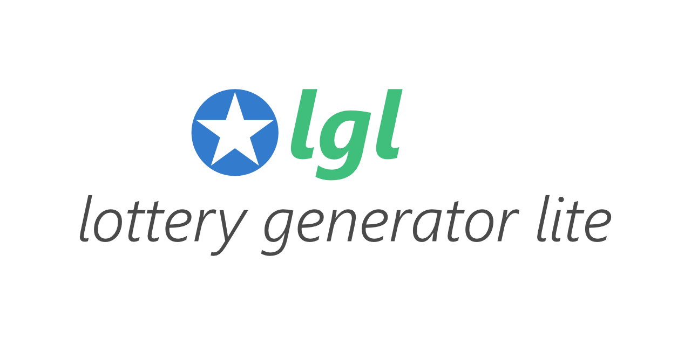

# Lottery Generator Lite (lgl)

A command-line tool for generating Mega Millions lottery numbers using the PCG64 pseudorandom number generator.

Mega Millions is an American multijurisdictional lottery game.

**Note:** This app is not official and has no relationship with Mega Millions. Use of this tool does not constitute an official lottery entry. Please play responsibly.

## Features

- **High-Quality Randomness**: Uses PCG64 (Permuted Congruential Generator), a fast and statistically robust PRNG
- **Mega Millions Format**: Generates 5 white balls (1-70) and 1 Mega Ball (1-25)
- **Batch Generation**: Create multiple draws in a single run
- **File Export**: Save generated numbers to a text file
- **Simple CLI**: Easy-to-use command-line interface with sensible defaults
- **Proper Error Handling**: Uses `anyhow` for clear, contextual error messages

## Installation

### From Source

```bash
# Clone the repository
git clone <repository-url>
cd lottery-generator

# Build and install
cargo build --release
cargo install --path .
```

### Prerequisites

- Rust 1.92.0 or higher
- Cargo package manager

## Usage

```bash
# Generate a single draw (default)
lgl

# Generate 10 draws
lgl 10

# Generate 5 draws and save to file
lgl 5 draws.txt

# View help
lgl --help

# Check version
lgl --version
```

### Command-line Arguments

```
Usage: lgl [COUNT] [PATH]

Arguments:
  [COUNT]  The number of draws to generate (default: 1)
  [PATH]   Optional path to save the numbers

Options:
  -h, --help     Print help
  -V, --version  Print version
```

### Example Output

```
lgl 0.1.0 — Generate Mega Millions lottery numbers

[12, 23, 34, 45, 67] | Mega Ball: 15
[5, 18, 29, 41, 58] | Mega Ball: 22
[7, 14, 33, 52, 69] | Mega Ball: 8
```

## Test Setup

### Running Tests

```bash
# Run all tests
cargo test
```

## Run from Docker

### Build Docker Image

```bash
# Build the image
docker build -t lottery-generator .

# Run the container
docker run --rm lottery-generator 5

# Save output to file (mount volume)
docker run --rm -v $(pwd):/output lottery-generator 10 /output/draws.txt
```

## Data

### Output Format

**Console Output:**
```
[2, 15, 33, 45, 67] | Mega Ball: 12
```

**File Output (draws.txt):**
```
[2, 15, 33, 45, 67] | Mega Ball: 12
[8, 19, 28, 51, 70] | Mega Ball: 23
[5, 14, 22, 41, 63] | Mega Ball: 7
```

### Mega Millions Rules

- **White Balls**: 5 numbers from 1 to 70 (no duplicates, displayed sorted)
- **Mega Ball**: 1 number from 1 to 25 (can match white balls)

## Dependencies

```toml
[dependencies]
anyhow = "1.0"        # Error handling
clap = { version = "4.5", features = ["derive"] }  # CLI parsing
rand = "0.8"          # Random number traits
rand_pcg = "0.3"      # PCG64 implementation
```

## License

Please see (the license file)[LICENSE.md].

## Links

- **Mega Millions Official**: https://www.megamillions.com/
- **PCG Random**: https://www.pcg-random.org/
- **Rust CLI book**: https://rust-cli.github.io/book/index.html
- **Rust Documentation**: https://doc.rust-lang.org/
- **Clap CLI**: https://docs.rs/clap/
- **Anyhow**: https://docs.rs/anyhow/

## History

### v0.1.0 (2025-12-30)
- Initial release
- Basic lottery number generation
- PCG64 random number generator
- Command-line interface with clap
- File output support
- Batch generation feature
- Comprehensive error handling with anyhow

---

**Disclaimer**: This tool generates random numbers for entertainment purposes only. It does not increase your chances of winning the lottery. Past draws do not influence future results. Please gamble responsibly.